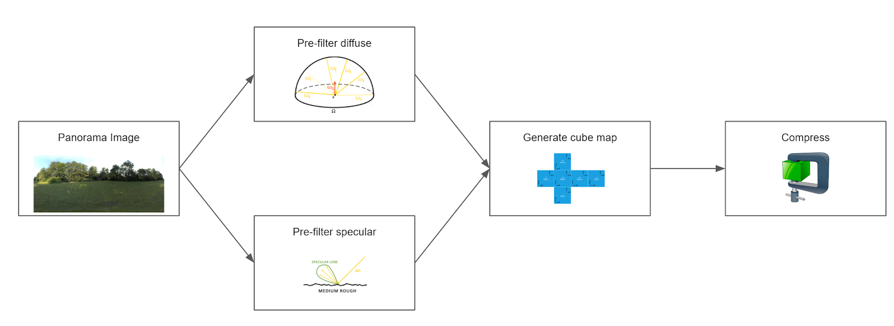

# glTF IBL Sampler

## Introduction

This project pre-filters an environment High Dynamic Range (HDR) panorama image and stores diffuse and specular parts in cube maps respectively. Considering different material characteristics, the specular part consists of several mip-map levels corresponding to different roughness values of the modeled material. The final basis compression into a [KTX2](https://github.com/KhronosGroup/KTX-Software/tree/ktx2) file ensures small file sizes while maintaining reasonable image quality.

Algorithm references:

* [Real Shading in Unreal Engine 4](https://blog.selfshadow.com/publications/s2013-shading-course/karis/s2013_pbs_epic_notes_v2.pdf)
* [GPU-Based Importance Sampling](https://developer.nvidia.com/gpugems/GPUGems3/gpugems3_ch20.html)
* [Runtime Environment Map Filtering for Image Based Lighting](https://placeholderart.wordpress.com/2015/07/28/implementation-notes-runtime-environment-map-filtering-for-image-based-lighting/)
* [Filtering shader](lib/shaders/filter.frag)

<!--
The official Khronos [glTF Sample Viewer](https://github.com/KhronosGroup/glTF-Sample-Viewer) is used to clarify, how e.g. a physically-based material has to be lit and rendered. In the [glTF 2.0 reference](https://www.khronos.org/files/gltf20-reference-guide.pdf), the default material model is the Metallic-Roughness-Model. 
-->

## Workflow

The individual transformations can be executed separately in the library, enabling the use of a cube map as input in future releases.  

* Environment HDR image &rightarrow; Cube Map  
* Cube Map &rightarrow; Filtered Cube Map  
* Filtered Cube Map &rightarrow; KTX2 Compressed Output File  

This separation of shader passes ensures both, flexibility and extensibility.
The pre-filtering will use the algorithms noted in the [glTF Sample Environments](https://github.com/ux3d/glTF-Sample-Environments) repository.



## Building

The project provides a cmake file to generate respective build files.

Third Party Requirements:

* Vulkan SDK
* Glslang (included in the Vulkan SDK)
* [STB](https://github.com/nothings/stb) image library (git submodule)
* [KTX2](https://github.com/KhronosGroup/KTX-Software/tree/ktx2) (git submodule)

Currently, libktx does not come with a CMake list and additional steps need to be taken (MSVC example):

* [Build libktx](https://github.com/KhronosGroup/KTX-Software/blob/ktx2/BUILDING.md) using the project files for your toolchain found in the ```thirdparty\ktx2\build\``` folder. E.g. thirdparty\ktx2\build\msvs\x64\vs2017
* Set ```KTX2_LIBRARY``` CMake variable to your .lib / .a file. E.g. E:\Projects\glTFIBLSampler\thirdparty\ktx2\build\msvs\x64\vs2017\Debug\libktx.gl.lib
* Generate the glTF-IBL-Sampler project using CMake
* (Windows) Copy ```libktx.gl.dll/dynlib``` and ```glew32.dll``` from the same folder to your executable folder (output containing cli.exe).

CMake option ```IBLSAMPLER_EXPORT_SHADERS``` can be used to automatically copy the shader folder to the executable folder when generating the project files. By default, shaders will be loaded from their source location in lib/shaders.

The glTF-IBL-Sampler consists of two projects: lib (shared library) and cli (executable). 

## Usage

The CLI takes an environment HDR image as input. The filtered specular and diffuse cube maps can be stored as KTX1 or KTX2 (with basis compression).

* ```-specular```: output path for specular term of filtered cube map
* ```-diffuse```: output path for diffuse term of filtered cube map
* ```-sampleCount```: number of samples used for filtering (default = 1024)
* ```-mipLevelCount```: number of mip levels of specular cube map
* ```-cubeMapResolution```: resolution of output cube map (default = 1024)
* ```-ktxVersion```: version 1 or version 2
* ```-compressionQuality```: compression level for KTX2 files in range 0 - 255, 0 -> no compression

Example

```
.\cli.exe -in ..\panorama_in.hdr -specular ..\..\specular_out.ktx2 -diffuse ..\diffuse_out.ktx2 -sampleCount 1024 -mipLevelCount 5 -cubeMapResolution 1024 -ktxVersion 2 -compressionQuality 128
```